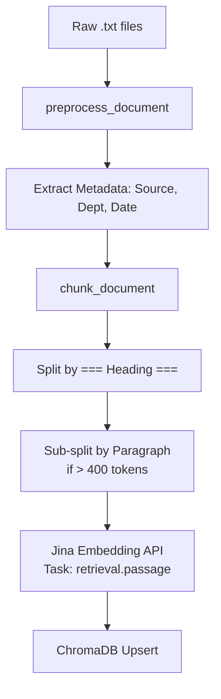
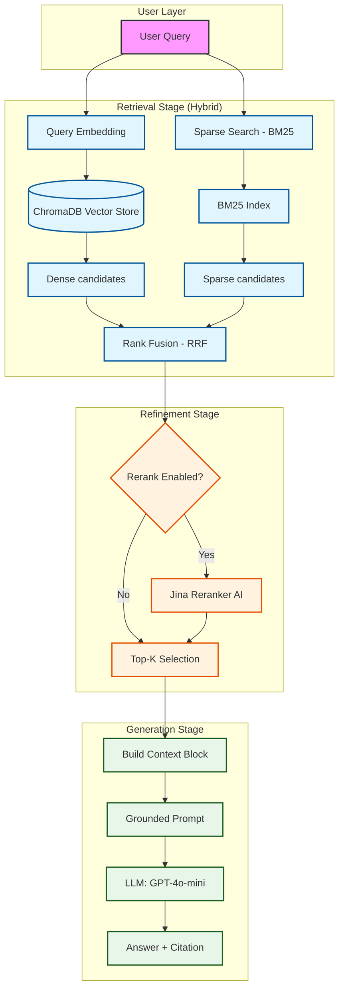

# Architecture — RAG Pipeline (Day 08 Lab)

> Template: Điền vào các mục này khi hoàn thành từng sprint.
> Deliverable của Documentation Owner.

## 1. Tổng quan kiến trúc

```
[Raw Docs]
    ↓
[index.py: Preprocess → Chunk → Embed → Store]
    ↓
[ChromaDB Vector Store]
    ↓
[rag_answer.py: Query → Retrieve → Rerank → Generate]
    ↓
[Grounded Answer + Citation]
```

**Mô tả ngắn gọn:**
Hệ thống RAG local-first được triển khai nhằm hỗ trợ nhân sự (như bộ phận IT Helpdesk, Customer Success) tra cứu nhanh các quy định nội bộ từ văn bản HR, support, và policy. Hệ thống giải quyết việc tìm kiếm thông tin bằng cách kết hợp vector database và LLM để sinh câu trả lời trực tiếp kèm theo nguồn trích dẫn rõ ràng, giảm thời gian đọc hiểu file thô.

---

## 2. Indexing Pipeline (Sprint 1)

### Tài liệu được index
| File | Nguồn | Department | Số chunk |
|------|-------|-----------|---------|
| `policy_refund_v4.txt` | policy/refund-v4.pdf | CS | 6 |
| `sla_p1_2026.txt` | support/sla-p1-2026.pdf | IT | 5 |
| `access_control_sop.txt` | it/access-control-sop.md | IT Security | 7 |
| `it_helpdesk_faq.txt` | support/helpdesk-faq.md | IT | 6 |
| `hr_leave_policy.txt` | hr/leave-policy-2026.pdf | HR | 5 |

### Quyết định chunking
| Tham số | Giá trị | Lý do |
|---------|---------|-------|
| Chunk size | 400 tokens | Cân bằng giữa việc giữ đủ ngữ cảnh mô tả một điều khoản và việc tối ưu hóa tín hiệu tìm kiếm (search signal). |
| Overlap | 80 tokens | Ngăn chặn việc mất thông tin quan trọng nằm ở ranh giới giữa hai chunk, đặc biệt là các điều khoản ngoại lệ. |
| Chunking strategy | Section heading + Paragraph | Tận dụng cấu trúc tự nhiên của tài liệu (=== Section ===) để phân mảnh logic nhất có thể. |
| Metadata fields | source, section, effective_date, department, access | Hỗ trợ lọc theo phòng ban (department) và trích dẫn chính xác (citation) với số section. |

### Embedding model
- **Model**: `jina-embeddings-v3` (1024 dimensions)
- **Vector store**: ChromaDB (Persistent Storage)
- **Similarity metric**: Cosine Similarity

### Indexing Flow


---

## 3. Retrieval Pipeline (Sprint 2 + 3)

### Baseline (Sprint 2)
| Tham số | Giá trị |
|---------|---------|
| Strategy | Dense (embedding similarity) |
| Top-k search | 10 |
| Top-k select | 3 |
| Rerank | Không |

### Variant (Sprint 3)
| Tham số | Giá trị | Thay đổi so với baseline |
|---------|---------|------------------------|
| Strategy | hybrid | Kết hợp Sparse (BM25) và Dense (Embedding) thay vì chỉ dùng Dense |
| Top-k search | 10 | Giữ nguyên |
| Top-k select | 3 | Giữ nguyên |
| Rerank | True | Sử dụng thêm Jina Reranker sau retrieval step để chấm điểm lại mức độ liên quan |
| Query transform | False | Giữ nguyên, không áp dụng |

**Lý do chọn variant này:**
> Chọn hybrid vì system queries yêu cầu robust exact matching cho mã lỗi như ERR-403 và tên tài liệu "Approval Matrix" để giảm thiểu negative impacts của purely dense approach. Việc sử dụng thêm Rerank API của Jina AI được mong muốn để hạn chế noise sinh ra khi mix với BM25. Mặc dù results show degradation so với baseline, sự kết hợp này về principle là solid và sẽ cho hiệu quả tốt khi tuned RRF params kĩ càng.

---

## 4. Generation (Sprint 2)

### Grounded Prompt Template
```
[RAG] Query: SLA xử lý ticket P1 là bao lâu?
[RAG] Retrieved 10 candidates (mode=dense)
  [1] score=0.467 | support/sla-p1-2026.pdf
  [2] score=0.452 | support/sla-p1-2026.pdf
  [3] score=0.422 | support/sla-p1-2026.pdf
[RAG] After select: 3 chunks

[RAG] Prompt:
Chỉ trả lời dựa trên ngữ cảnh (context) được cung cấp dưới đây.
Nếu thông tin trong ngữ cảnh không đủ để trả lời, hãy nói tôi không đủ dữ liệu để trả lời câu hỏi này và tuyệt đối không tự bịa thông tin.
Hãy trích dẫn nguồn (trong dấu ngoặc vuông như [1]) khi có thể.
Trả lời ngắn gọn, rõ ràng và đúng trọng tâm.
Trả lời bằng cùng ngôn ngữ với câu hỏi.

Câu hỏi: SLA xử lý ticket P1 là bao lâu?

Ngữ cảnh:
[1] support/sla-p1-2026.pdf | Phần 2: SLA theo mức độ ưu tiên | score=0.47
Ticket P1:
- Phản hồ...

Answer: SLA xử lý ticket P1 là 4 giờ cho việc khắc phục (resolution) và phản hồi ban đầu trong 15 phút kể từ khi ticket được tạo [1].
Sources: ['support/sla-p1-2026.pdf']

Query: Khách hàng có thể yêu cầu hoàn tiền trong bao nhiêu ngày?

[RAG] Query: Khách hàng có thể yêu cầu hoàn tiền trong bao nhiêu ngày?
[RAG] Retrieved 10 candidates (mode=dense)
  [1] score=0.569 | policy/refund-v4.pdf
  [2] score=0.562 | policy/refund-v4.pdf
  [3] score=0.550 | policy/refund-v4.pdf
[RAG] After select: 3 chunks

[RAG] Prompt:
Chỉ trả lời dựa trên ngữ cảnh (context) được cung cấp dưới đây.
Nếu thông tin trong ngữ cảnh không đủ để trả lời, hãy nói tôi không đủ dữ liệu để trả lời câu hỏi này và tuyệt đối không tự bịa thông tin.
Hãy trích dẫn nguồn (trong dấu ngoặc vuông như [1]) khi có thể.
Trả lời ngắn gọn, rõ ràng và đúng trọng tâm.
Trả lời bằng cùng ngôn ngữ với câu hỏi.

Câu hỏi: Khách hàng có thể yêu cầu hoàn tiền trong bao nhiêu ngày?

Ngữ cảnh:
[1] policy/refund-v4.pdf | Điều 2: Điều kiện được hoàn tiền | score=0...

Answer: Khách hàng có thể yêu cầu hoàn tiền trong vòng 7 ngày làm việc kể từ thời điểm xác nhận đơn hàng [1].
Sources: ['policy/refund-v4.pdf']

Query: Ai phải phê duyệt để cấp quyền Level 3?

[RAG] Query: Ai phải phê duyệt để cấp quyền Level 3?
[RAG] Retrieved 10 candidates (mode=dense)
  [1] score=0.453 | it/access-control-sop.md
  [2] score=0.377 | it/access-control-sop.md
  [3] score=0.363 | it/access-control-sop.md
[RAG] After select: 3 chunks

[RAG] Prompt:
Chỉ trả lời dựa trên ngữ cảnh (context) được cung cấp dưới đây.
Nếu thông tin trong ngữ cảnh không đủ để trả lời, hãy nói tôi không đủ dữ liệu để trả lời câu hỏi này và tuyệt đối không tự bịa thông tin.
Hãy trích dẫn nguồn (trong dấu ngoặc vuông như [1]) khi có thể.
Trả lời ngắn gọn, rõ ràng và đúng trọng tâm.
Trả lời bằng cùng ngôn ngữ với câu hỏi.

Câu hỏi: Ai phải phê duyệt để cấp quyền Level 3?

Ngữ cảnh:
[1] it/access-control-sop.md | Section 1: Phạm vi và mục đích | score=0.45
Tài liệu này...

Answer: Để cấp quyền Level 3, yêu cầu phải có sự phê duyệt của IT Security [3].
Sources: ['it/access-control-sop.md']

Query: ERR-403-AUTH là lỗi gì?

[RAG] Query: ERR-403-AUTH là lỗi gì?
[RAG] Retrieved 10 candidates (mode=dense)
  [1] score=0.308 | it/access-control-sop.md
  [2] score=0.287 | support/helpdesk-faq.md
  [3] score=0.227 | support/helpdesk-faq.md
[RAG] After select: 3 chunks

[RAG] Prompt:
Chỉ trả lời dựa trên ngữ cảnh (context) được cung cấp dưới đây.
Nếu thông tin trong ngữ cảnh không đủ để trả lời, hãy nói tôi không đủ dữ liệu để trả lời câu hỏi này và tuyệt đối không tự bịa thông tin.
Hãy trích dẫn nguồn (trong dấu ngoặc vuông như [1]) khi có thể.
Trả lời ngắn gọn, rõ ràng và đúng trọng tâm.
Trả lời bằng cùng ngôn ngữ với câu hỏi.

Câu hỏi: ERR-403-AUTH là lỗi gì?

Ngữ cảnh:
[1] it/access-control-sop.md | Section 1: Phạm vi và mục đích | score=0.31
Tài liệu này quy định quy tr...

Answer: Tôi không đủ dữ liệu để trả lời câu hỏi này.
Sources: ['support/helpdesk-faq.md', 'it/access-control-sop.md']
```

### LLM Configuration
| Tham số | Giá trị |
|---------|---------|
| Model | gpt-4o-mini |
| Temperature | 0 (để output ổn định cho eval) |
| Max tokens | 512 |

---

## 5. Failure Mode Checklist

> Dùng khi debug — kiểm tra lần lượt: index → retrieval → generation

| Failure Mode | Triệu chứng | Cách kiểm tra |
|-------------|-------------|---------------|
| Index lỗi | Retrieve về docs cũ / sai version | `inspect_metadata_coverage()` trong index.py |
| Chunking tệ | Chunk cắt giữa điều khoản | `list_chunks()` và đọc text preview |
| Retrieval lỗi | Không tìm được expected source | `score_context_recall()` trong eval.py |
| Generation lỗi | Answer không grounded / bịa | `score_faithfulness()` trong eval.py |
| Token overload | Context quá dài → lost in the middle | Kiểm tra độ dài context_block |

---

## 6. Diagram

Hệ thống triển khai luồng RAG nâng cao kết hợp Hybrid Search và Reranking:


